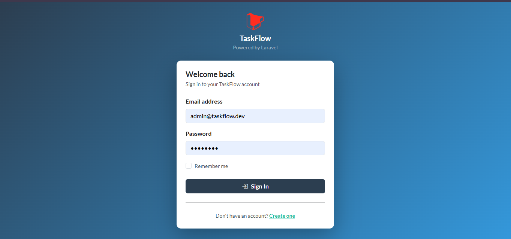
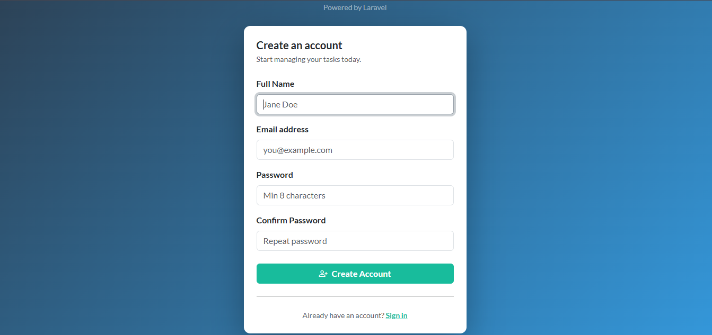
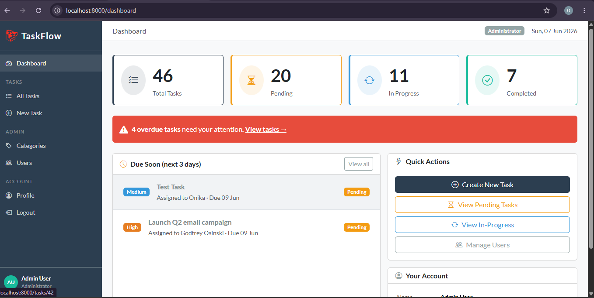
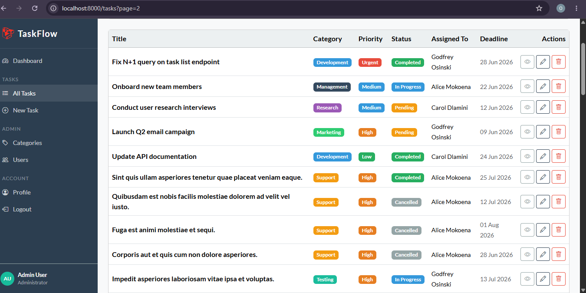
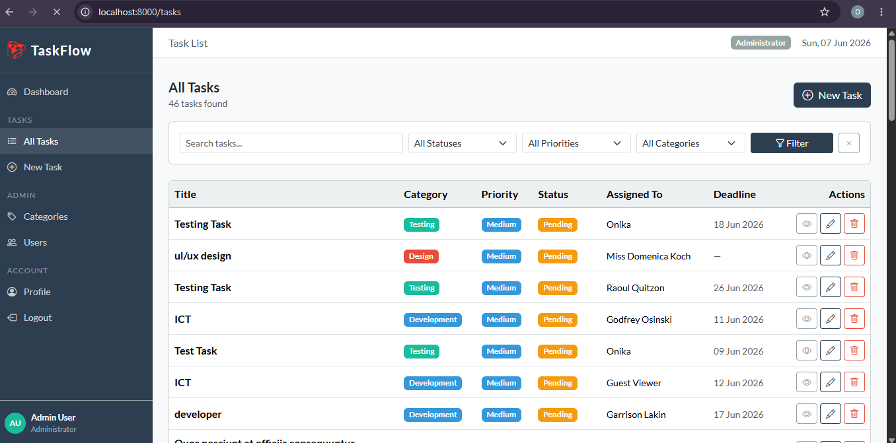
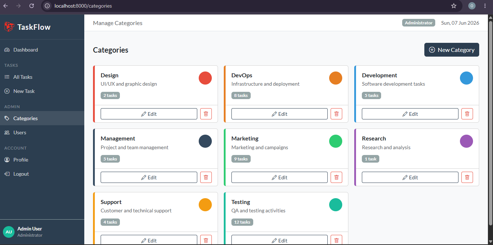
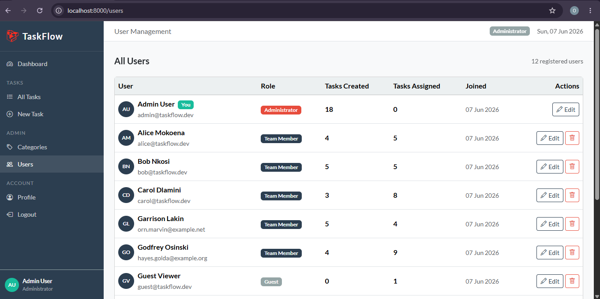
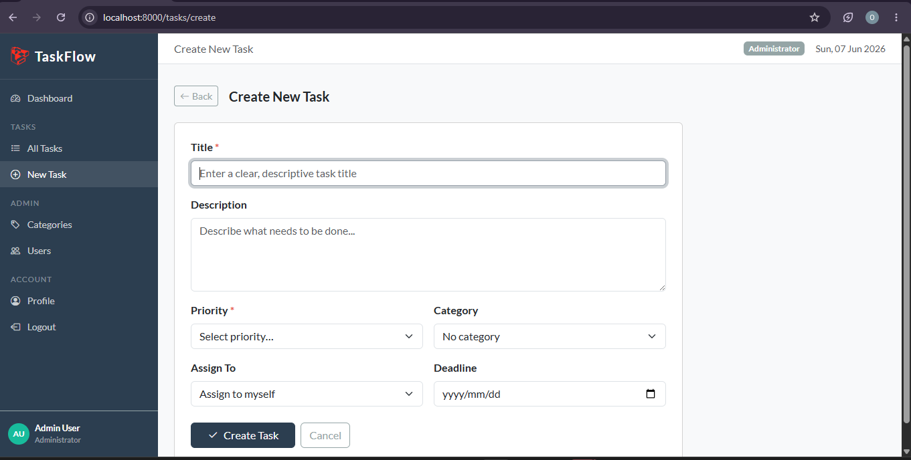
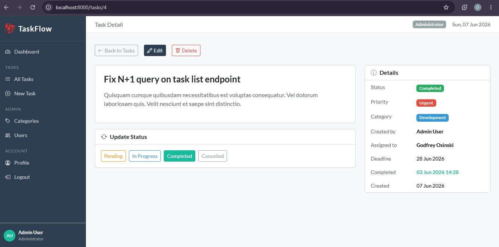
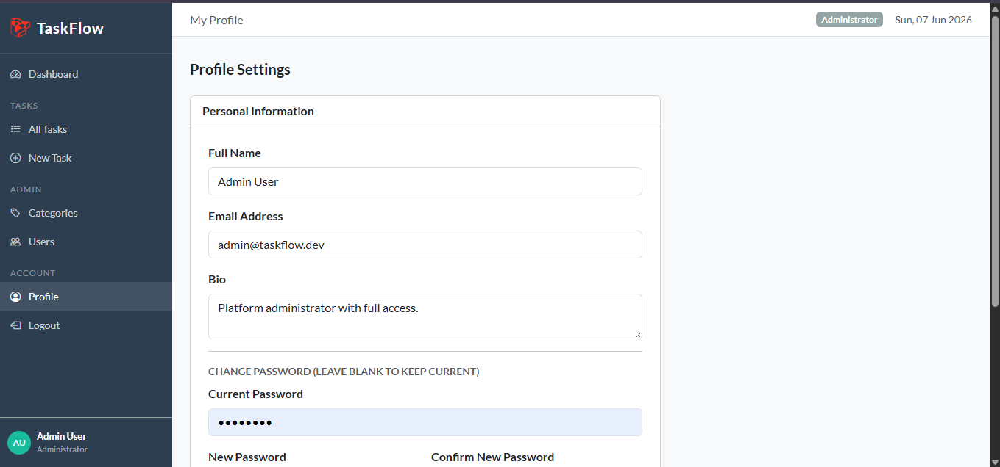

# Task Management System

A full-featured task management web application built with Laravel 12, featuring user authentication, role-based access control, task assignment, categories, priorities, and deadline tracking.

---

# 📋 Table of Contents

* [Project Overview](#project-overview)
* [Technologies Used](#technologies-used)
* [Features](#features)
* [Setup Instructions](#setup-instructions)
* [Environment Variables](#environment-variables)
* [Database Schema](#database-schema)
* [User Roles](#user-roles)
* [API Routes](#api-routes)
* [Testing the Application](#testing-the-application)
* [Screenshots](#screenshots)
* [Challenges & Solutions](#challenges--solutions)
* [Conclusion](#conclusion)

---

# 📖 Project Overview

The Task Management System is a web-based application developed using Laravel 12 as part of the ICE360 Web Frameworks project. The application allows users to create, assign, manage, and track tasks within an organization or team environment.

The system was designed to improve productivity by providing task categorization, priority management, status tracking, and role-based access control. The project demonstrates the implementation of Laravel's core features including routing, middleware, controllers, Blade templates, Eloquent ORM, migrations, validation, authentication, and authorization.

The application follows Laravel's MVC architecture and industry-standard development practices.

---

# 🛠 Technologies Used

| Technology      | Version | Purpose                 |
| --------------- | ------- | ----------------------- |
| Laravel         | 12.x    | Backend Framework       |
| PHP             | 8.2.12  | Server-side Programming |
| SQLite          | 3.x     | Database                |
| Bootstrap       | 5.3     | Frontend Styling        |
| Laravel Breeze  | Latest  | Authentication          |
| Blade Templates | Latest  | Frontend Rendering      |
| Vite            | Latest  | Asset Compilation       |
| Composer        | Latest  | Dependency Management   |
| GitHub          | Latest  | Version Control         |

---

# ✨ Features

## Core Features

* User registration and authentication
* Create, edit, view and delete tasks
* Assign tasks to specific users
* Task categories management
* Task priority management
* Task status updates
* Dashboard statistics
* Recent task display
* Deadline tracking

## Admin Features

* Manage categories
* Manage priorities
* View all tasks
* Full CRUD functionality

## Security Features

* Role-Based Access Control
* Laravel Policies
* CSRF Protection
* Input Validation
* SQL Injection Prevention
* XSS Protection

---

# 🚀 Setup Instructions

## Prerequisites

Before running the project, ensure the following software is installed:

* PHP 8.2+
* Composer
* Node.js
* SQLite
* Git

## Installation

### Clone Repository

```bash
git clone https://github.com/yourusername/task-management-app.git
cd task-management-app
```

### Install PHP Dependencies

```bash
composer install
```

### Install Node Dependencies

```bash
npm install
```

### Configure Environment

```bash
cp .env.example .env
```

Generate application key:

```bash
php artisan key:generate
```

### Configure Database

Open `.env` and configure:

```env
DB_CONNECTION=sqlite
```

Create SQLite database:

```bash
touch database/database.sqlite
```

### Run Migrations

```bash
php artisan migrate
```

### Seed Database

```bash
php artisan db:seed
```

### Build Assets

```bash
npm run build
```

### Start Server

```bash
php artisan serve
```

Access application:

```text
http://127.0.0.1:8000
```

---

# 🔧 Environment Variables

Example configuration:

```env
APP_NAME="Task Management System"
APP_ENV=local
APP_DEBUG=true
APP_URL=http://localhost

DB_CONNECTION=sqlite

SESSION_DRIVER=database
```

---

# 📊 Database Schema

## Users

| Column   | Type   |
| -------- | ------ |
| id       | bigint |
| name     | string |
| email    | string |
| role     | enum   |
| password | string |

## Tasks

| Column      | Type       |
| ----------- | ---------- |
| id          | bigint     |
| title       | string     |
| description | text       |
| status      | enum       |
| deadline    | date       |
| assigned_to | foreign_id |
| created_by  | foreign_id |
| category_id | foreign_id |
| priority_id | foreign_id |

## Categories

| Column | Type   |
| ------ | ------ |
| id     | bigint |
| name   | string |

## Priorities

| Column | Type    |
| ------ | ------- |
| id     | bigint  |
| name   | string  |
| level  | integer |

## Relationships

* User → Creates Many Tasks
* User → Assigned Many Tasks
* Task → Belongs To Category
* Task → Belongs To Priority
* Category → Has Many Tasks
* Priority → Has Many Tasks

---

# 👥 User Roles

| Role        | Permissions           |
| ----------- | --------------------- |
| Admin       | Full system access    |
| Team Member | Manage assigned tasks |
| Guest       | Read-only access      |

---

# 🌐 API Routes

## Authentication

| Method | Route     |
| ------ | --------- |
| GET    | /register |
| POST   | /register |
| GET    | /login    |
| POST   | /login    |
| POST   | /logout   |

## Dashboard

| Method | Route      |
| ------ | ---------- |
| GET    | /dashboard |

## Tasks

| Method | Route         |
| ------ | ------------- |
| GET    | /tasks        |
| POST   | /tasks        |
| GET    | /tasks/create |
| GET    | /tasks/{task} |
| PUT    | /tasks/{task} |
| DELETE | /tasks/{task} |

---

# 🧪 Testing the Application

## Register User

1. Open registration page
2. Enter user details
3. Create account

## Login

1. Enter email
2. Enter password
3. Sign in

## Create Task

1. Navigate to Tasks
2. Click Create Task
3. Complete form
4. Save task

## Update Task

1. Open task
2. Edit information
3. Update status
4. Save changes

---
## Login Page



## Registration Page



## Dashboard



## Task List





## Categories



## Users



## Create New Task



## Single Task view



## Profile 




# 🐛 Challenges & Solutions

## Challenge 1: Table Naming Convention

**Problem:** Laravel generated unexpected table names.

**Solution:** Explicitly defined table names within models.

## Challenge 2: PowerShell Execution Policy

**Problem:** npm commands were blocked.

**Solution:** Updated PowerShell execution policy.

## Challenge 3: PHP Version Compatibility

**Problem:** Laravel 12 requires PHP 8.2+.

**Solution:** Installed PHP 8.2.12.

## Challenge 4: SQLite Database Setup

**Problem:** Database file creation issues.

**Solution:** Created SQLite database manually.

## Challenge 5: Missing Views

**Problem:** Controllers referenced missing Blade templates.

**Solution:** Created all required Blade views.

---

# 💬 Code Documentation

Comments have been included throughout the project to explain complex logic, controller functionality, model relationships, authorization policies, middleware behavior, and database interactions. This improves maintainability and makes the code easier to understand for future developers.

---

# 🎯 Conclusion

The Task Management System successfully demonstrates the use of Laravel 12 to build a secure, scalable, and database-driven web application. The project implements authentication, authorization, task management, role-based access control, migrations, validation, and Eloquent ORM while following Laravel best practices.

The project provided valuable experience in full-stack web development and strengthened understanding of modern software development workflows.
